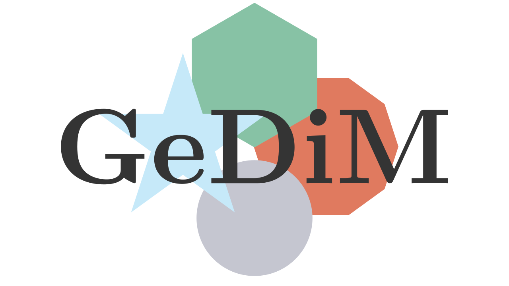

# 

**`GeDiM`** (GEometry for DIscretization MEthod library) is an open-source C++ library based on collaborative development. 
It provides a flexible framework for the common geometrical operations in 1D, 2D, and 3D used in discretization methods for solving linear and nonlinear partial differential equations. 

**`GeDiM`** is inspired by and built upon the foundational research of the Numerical Analysis Group in the Department of Mathematical Sciences "Giuseppe Luigi Lagrange" (DISMA) at the Politecnico di Torino.

## How To Install

Installation is based on [CMake](https://cmake.org/).
Minimum CMake 3.12 version is required.

To build the library we require **C++-20** standard.

We develop and test with `gcc` compiler.
Minimum version required is `gcc-10`.
See [compiler support](https://en.cppreference.com/w/cpp/compiler_support/20) for more information. 

After the build process the library is installed in `CMAKE_INSTALL_PREFIX` folder.

By default `CMAKE_INSTALL_PREFIX` value is the subfolder `GeDiM/GeDiM` in build folder.

To change the installation folder set the CMake variable `CMAKE_INSTALL_PREFIX`.

### External Dependencies 

**`GeDiM`** interfaces external libraries.

The installation requires the external dependencies already compiled and installed.
Set the CMake variable `CMAKE_PREFIX_PATH` to give **`GeDiM`** the path where the external libraries are installed.

The installation of most of the external dependencies can be found in `3rd_party_libraries` subfolder.

#### Required Libraries

**`GeDiM`** linear algebra operations are based on 

- [Eigen](https://eigen.tuxfamily.org/index.php?title=Main_Page) <a href="https://eigen.tuxfamily.org/index.php?title=Main_Page#License"></a>
- [BLAS](https://www.netlib.org/blas/) <a href="https://www.netlib.org/blas/#_licensing"></a> 	            
- [LAPACK](https://www.netlib.org/lapack/) <a href="https://www.netlib.org/lapack/#_licensing"></a>   

#### Optional Libraries

Moreover, **`GeDiM`** currently interfaces and exploits the following optional libraries:
                                     
- [Triangle](https://www.cs.cmu.edu/~quake/triangle.html)
- [TetGen](https://wias-berlin.de/software/index.jsp?id=TetGen&lang=1) <a href="https://wias-berlin.de/software/tetgen/FAQ-license.jsp"></a>
- [Voro++](https://math.lbl.gov/voro++/) <a href="https://github.com/chr1shr/voro/blob/master/LICENSE"></a>   			  	                   
- [SuiteSparse](https://people.engr.tamu.edu/davis/suitesparse.html) <a href="https://sparse.tamu.edu/about"></a>     				            
- [PETSc](https://petsc.org/release/) <a href="https://gitlab.com/petsc/petsc/-/blob/main/LICENSE?ref_type=heads"></a>                               
- [METIS](https://karypislab.github.io/METIS/)  <a href="https://github.com/KarypisLab/METIS/blob/master/LICENSE"></a>                        
- [VTK](https://vtk.org/) <a href="https://vtk.org/about/"></a> 

To activate them can use the CMake variables:

```bash
Name                         Default
ENABLE_TRIANGLE              OFF
ENABLE_TETGEN                OFF
ENABLE_VORO                  OFF
ENABLE_SUITESPARSE           OFF
ENABLE_PETSC                 OFF
ENABLE_METIS                 OFF
ENABLE_VTK                   OFF
```

## Unit Test

Unit test for **`GeDiM`** are available to check the correct compilation of the library.

Activate the CMake variable ` ENABLE_GEDIM_UNIT_TESTS`, by default `OFF` to build the tests.

The unit tests are based on [GoogleTest](https://github.com/google/googletest) framework.
The `GTest` and `GMock` library shall be already installed in your computer to properly build the unit tests.
